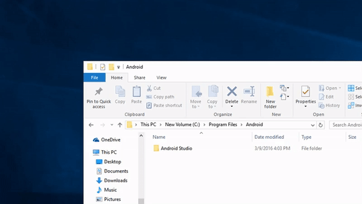

# Audio

## Programs
### Requirements
- A nus3audio editor (you can pick any one of these)
    - [nus3audio-rs](https://github.com/jam1garner/nus3audio-rs/releases) (Windows/MacOS/Linux)
    - [NUS3Audio Editor](https://gamebanana.com/tools/6927) (Windows)
    - [simple-nus3audio-gui](https://gamebanana.com/tools/8340) (Windows/Linux)
    - [Smash Ultimate Tools - Editing](https://smashultimatetools.com/index.php?page=nus3audioEditor) (Multiplatform)
- [.NET Core 6.0 Runtime](https://dotnet.microsoft.com/en-us/download/dotnet/6.0)
- [VGAudio](https://github.com/Coolsonickirby/Smash-Ultimate-Documentation/blob/main/programs/vgaudio.zip) (Windows/MacOS/Linux)

### Optional
- [Audacity](https://www.audacityteam.org/download/) (Windows/MacOS/Linux)
- [nus3bank-volume-GUI](https://github.com/Pacil142857/nus3bank-volume-GUI) (Windows)

## Music Modding

### Creating a lopus file
1. Make sure your music file is a WAV file with a sample rate of 48000hz
    - If you're not sure/want to make sure 100% it is, then import your wav into Audacity and set the `Project Rate` at the bottom left to `48000` then export it to wav
    
2. Select two regions in your song and note down the start and end samples if you want your song to loop
3. Now open up a command prompt instance in the folder with VGAudioCli and run the following command (replace the brackets with the respective information)
    - `dotnet VGAudioCli.dll -i <input path> -o <output name>.lopus -l <loop start>-<loop end> --bitrate 64000 --CBR --opusheader namco`
    
4. Afterwards you should have a lopus file.

### Creating a nus3audio file

#### Using nus3audio-rs
1. Open up a command prompt instance in the folder with the nus3audio program and run the following command (replace the brackets with the respective information)
    - `nus3audio -n -A <whatever_you_want> <lopus path> -w <output name>.nus3audio`
    
2. You're now done with the nus3audio. Move on to `Loading the nus3audio in-game`

#### Using NUS3Audio Editor
1. Open a pre-existing nus3audio file (either from the data.arc or a pre-existing mod)
2. Click the first entry in there and press `Replace`
3. Select the lopus file
4. Save the file
5. You're now done with the nus3audio. Move on to `Loading the nus3audio in-game`

#### Using simple-nus3audio-gui
1. Click `File -> New`
2. Click `Edit -> Add Sound`
3. Click the first entry and then `Edit -> Sound Properties`
4. Select `LOPUS format`
5. Enable `Loop Audio`
6. Set `Loop from` to your start loop sample & `Loop to` to your loop end sample
7. Hit `Ok`
8. Click `Edit -> Replace Single Sound` and select your lopus file
9. Click `File -> Save nus3audio` and save it
10. You're now done with the nus3audio. Move on to `Loading the nus3audio in-game`

#### Using Smash Ultimate Tools
1. Open a pre-existing nus3audio file (either from the data.arc or a pre-existing mod)
2. Click `Choose File` on the first entry
3. Select the lopus file
4. Save the file
5. You're now done with the nus3audio. Move on to `Loading the nus3audio in-game`

## Voices/SFX Modding
### Creating a idsp file
1. Make sure your music file is a WAV file with any sample rate
    - If you're not sure/want to make sure 100% it is, then import your wav into Audacity and set the `Project Rate` to anything you want (I recommend 44100hz)
    
2. Now open up a command prompt instance in the folder with VGAudioCli and run the following command (replace the brackets with the respective information)
    - `dotnet VGAudioCli.dll -i <input path> -o <output name>.idsp`
    
3. Afterwards you should have a idsp file.

### Modifying a nus3audio file
#### Using nus3audio-rs
1. Open up a command prompt instance in the folder with the nus3audio program and run the following command (replace the brackets with the respective information)
    - `nus3audio <nus3audio path> -v`
    
2. Press `e` and hit enter
3. Type the id of the entry you want to replace and hit enter
4. Press `d` and hit enter
5. Enter the idsp path you want to replace it with and hit enter
6. Press `q` and hit enter
7. Repeat 2-6 for each entry you want to edit
8. Press `w` and hit enter
9. Enter `<nus3audio name>.nus3audio` and hit enter
10. Press `q` and hit enter
11. You're now done with the nus3audio. Move on to `Loading the nus3audio in-game`

#### Using NUS3Audio Editor
1. Open the nus3audio file you want to edit
2. Click the entry you want to replace and press `Replace`
3. Select the idsp file you want to replace it with
4. Repeat 2-3 for each entry you want to edit
5. Save the file
6. You're now done with the nus3audio. Move on to `Loading the nus3audio in-game`

#### Using simple-nus3audio-gui
1. Open the nus3audio file you want to edit
2. Select the entry you want to edit
3. Click `Edit -> Replace Single Sound` or press `Ctrl + R`
4. Select the idsp file you want to replace it with
5. Repeat 2-4 for each entry you want to edit
6. Save the file
7. You're now done with the nus3audio. Move on to `Loading the nus3audio in-game`

#### Using Smash Ultimate Tools
1. Open the nus3audio file you want to edit
2. Click `Choose File` for the entry you want to edit
3. Select the idsp file you want to replace it with
4. Repeat 2-3 for each entry you want to edit
5. Save the file
6. You're now done with the nus3audio. Move on to `Loading the nus3audio in-game`

### Loading the nus3audio in-game
1. Make sure you have ARCropolis set up properly and working
2. Create a folder in `sd:/ultimate/mods` with any folder name (I recommend naming it something related to what the mod does)
3. Inside that folder, replicate the ARC path of the file you want to replace (make sure you replace `:` with `;`)
4. Launch the game and make sure the mod is enabled and it should work!
```
Format: sd:/ultimate/mods/<Mod Folder Name>/<ARC path>
Examples:
sd:/ultimate/mods/My Cool Music Mods/stream;/sound/bgm/bgm_crs01_menu.nus3audio
sd:/ultimate/mods/Super Cool Sonic Voice Mod/sound/bank/fighter_voice/vc_sonic.nus3audio
```