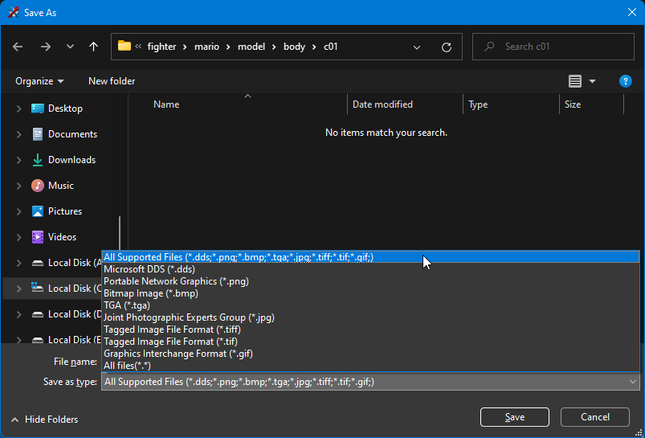
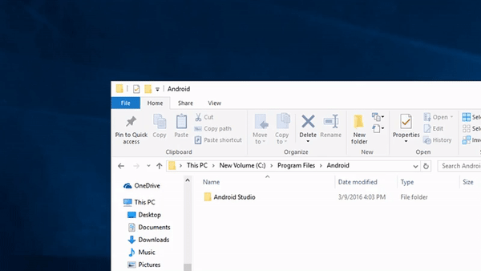

# Textures

## Programs
### Requirements
- A photo editor
- A nutexb creator/editor (you can pick any one of these)
    - [Switch Toolbox](https://github.com/KillzXGaming/Switch-Toolbox/releases/tag/EXPERIMENTAL_LATEST) (Windows)
    - [img2nutexb](https://github.com/jam1garner/img2nutexb/releases) (Windows/Linux)

## Converting a nutexb to an image (Switch Toolbox Only)
1. Click `File -> Open` and select a nutexb file
2. Right-click on the mini-preview on the left side and press `Export`
3. Select the type of file you want to export it as at the bottom
    
4. Press `Save`

## Converting a image to a nutexb
### Switch Toolbox
1. Open a nutexb file to use as a base
2. Right-click on the mini-preview on the left side and press `Replace`
3. Select your image
4. Press `Ok`
5. Click `File -> Save As` and save the nutexb
6. You're now done with the nutexb. Move on to `Loading the nutexb in-game`

### img2nutexb
1. Open up a command prompt instance in the folder with the img2nutexb program and run the following command (replace the brackets with the respective information)
    - `img2nutexb <image path> <nutexb name>.nutexb`
    
2. You're now done with the nutexb. Move on to `Loading the nutexb in-game`

## Loading the nutexb in-game
1. Make sure you have ARCropolis set up properly and working
2. Create a folder in `sd:/ultimate/mods` with any folder name (I recommend naming it something related to what the mod does)
3. Inside that folder, replicate the ARC path of the file you want to replace (make sure you replace `:` with `;`)
4. Launch the game and make sure the mod is enabled and it should work!
```
Format: sd:/ultimate/mods/<Mod Folder Name>/<ARC path>
Examples:
sd:/ultimate/mods/Ice Mario/fighter/mario/model/body/c00/def_mario_001_col.nutexb
sd:/ultimate/mods/Void Sonic/fighter/sonic/model/body/c00/def_sonic_001_col.nutexb
sd:/ultimate/mods/Destroyed Battlefield/stage/battlefield/normal/model/ring_nocastshadow_set/battlefield_ring_stoneline01_col.nutexb
```