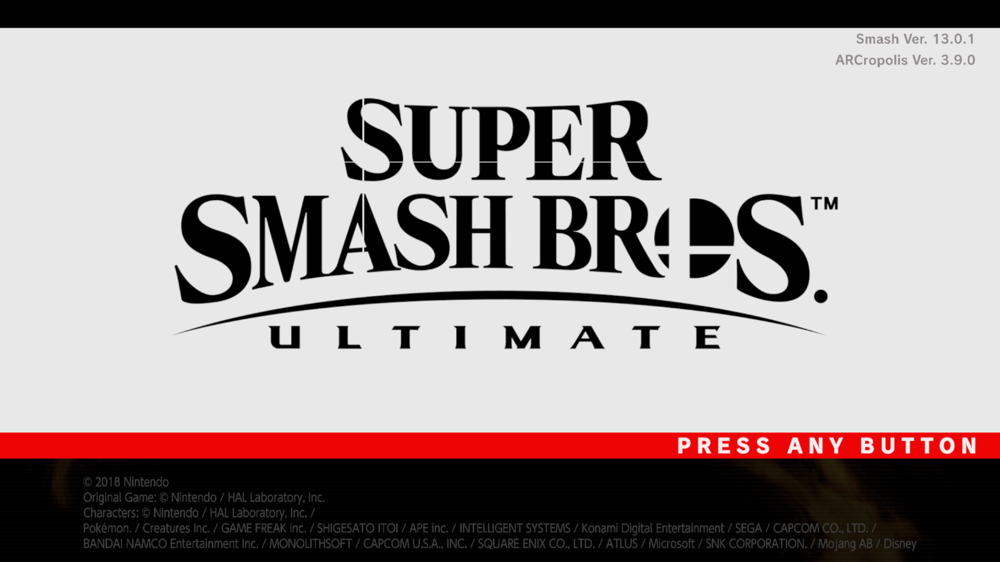
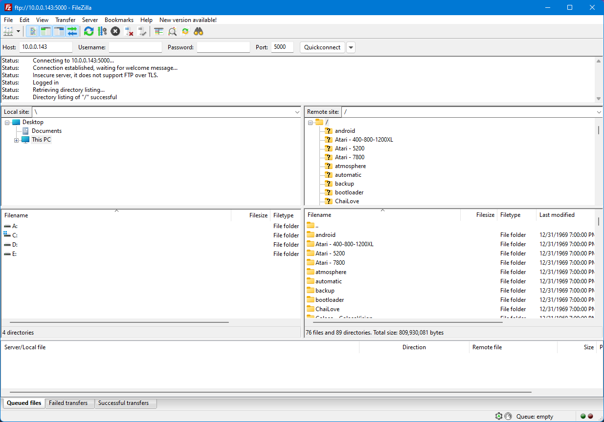

# Modding Setup

To run our mods and custom code, we either need to modify the console to run a custom firmware or use Ryujinx. For the console, we'll be using Atmosphere for this, since it's the most stable custom firmware and the only one being actively worked on.

Covering how to mod your switch from scratch would be a undertaking that this site isn't suited for, so follow [this guide here](https://nh-server.github.io/switch-guide/) to setup Atmosphere on your switch.

This guide will be a minimal guide to getting the barebones of Super Smash Bros. Ultimate Modding set up. If you want a more comprehensive guide for just using mods, you can [follow this guide for console modding](https://gamebanana.com/tuts/12827) or [follow this guide for Ryujinx modding](https://gamebanana.com/tuts/14311).

## Disclaimer
- If a folder doesn't exist, then create it
- If it asks you to overwrite, then overwrite
- `sd:/` means the root of your SD Card (like the `C:/` drive or `D:/` drive)

## Requirements
   - [Skyline](https://github.com/skyline-dev/skyline/releases) (Switch/Ryujinx)
   - [ARCropolis](https://github.com/Raytwo/ARCropolis/releases/latest) (Switch/Ryujinx)
   - [sys-ftpd-light](https://github.com/Genwald/sys-ftpd-light/releases/latest) (Switch)
   - One of the FTP clients (Console Only)
      - [FileZilla](https://filezilla-project.org/download.php) (Switch) (Windows/MacOS/Linux)

## Console Setup

### Setting up the SD Card
1. Copy the `exefs` folder in the Skyline download to `sd:/atmosphere/contents/01006A800016E000/`
2. Copy the `atmosphere` & `ultimate` folders in the ARCropolis download to `sd:/`
3. Copy the `atmosphere` & `config` folders in the sys-ftpd-light download to `sd:/`
4. Boot into Atmosphere and open up Super Smash Bros. Ultimate.
5. Check the update title at the top left of the title screen. If it says `ARCropolis Ver. X.X.X`, then you're done!
   

### Using FTP to access and modify your SD Card over Network
1. Install FileZilla (following the installer on-screen instructions (make sure to not install the ads in the installer!))
2. Open up FileZilla
3. In the following fields, enter the following information:
    - `Host` -> your switch's IP address
    - `Port` -> 5000
4. Click `Quickconnect` and then click `OK` on the pop-up
5. You should now be successfully connected to your switch! Now you can transfer files over the network without having to take out the microSD card.
   

## Ryujinx Setup
1. Right-click on Super Smash Bros. Ultimate in Ryujinx and click `Open Mods Directory`
2. Copy the `exefs` folder in the Skyline download to the directory that was opened by Ryujinx
3. Navigate to `atmosphere/contents/01006A800016E000/` in the ARCropolis zip and copy the `romfs` folder to the directory that was opened by Ryujinx
4. Run Super Smash Bros. Ultimate
5. Check the update title at the top left of the title screen. If it says `ARCropolis Ver. X.X.X`, then you're done!
   